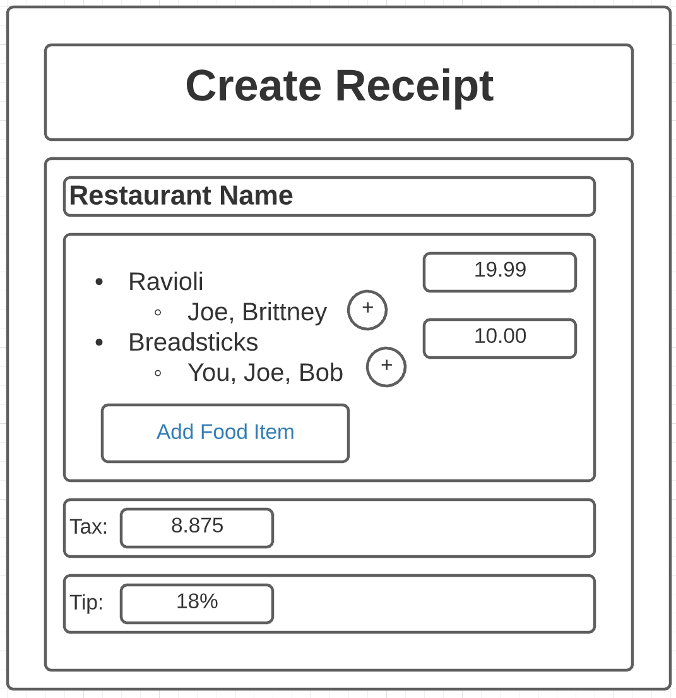
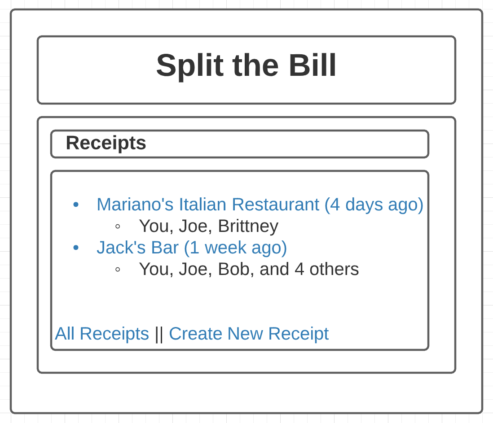
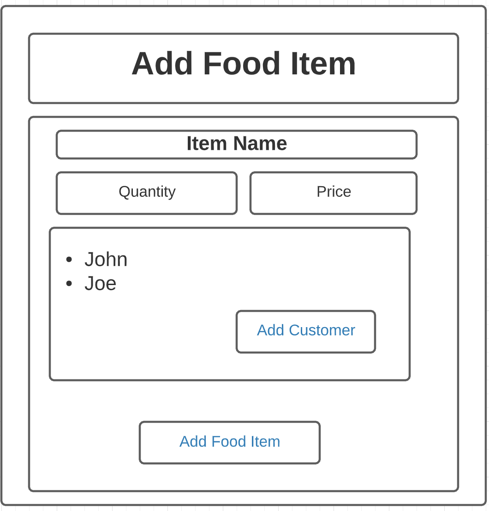

The content below is an example project proposal / requirements document. Replace the text below the lines marked "__TODO__" with details specific to your project. Remove the "TODO" lines.

# Split the Bill

## Overview

Going to a restaurant with a group of friends is always a good time, but eventually someone has to foot the bill. Since often times people share food items or entrees have different costs, splitting the bill fairly becomes a difficult task. 

Split the Bill serves as a website that allows users to enter the items on a receipt, along with the person or persons that ordered the item, and it calculates everyones fair share of the bill, including proportional tax and tip. 

## Data Model

The application will store Users, Receipts, and Food Items.
* users can have a stored history of past receipts or enter new ones
* each receipt will have multiple food items on it (by embedding)
* each receipt will have a list of users who are responsible for paying (vie reference)


An Example User:

```javascript
{
  username: "shannonshopper",
  hash: // a password hash,
  receipts: // an array of references to Receipt documents
}
```

An Example Receipt with Embedded Food Items:

```javascript
{
  user: // a reference to a User object
  name: "Favorite Restaurant",
  items: [
    { name: "Ravioli", quantity: "1", price: "19.99", customers: ["John"]},
    { name: "Spaghetti", quantity: "2", price: "38.98", customers: ["Brittney", "Joe"]},
    { name: "Breadsticks", quantity: "1", price: "10.00", customers: ["John", "Brittney", "Joe"]}
  ],
  tax: "8.875",
  tip: "18",
  createdAt: // timestamp
}
```


## [Link to Commented First Draft Schema](db.js) 


## Wireframes

/receipt/create - page for creating a new receipt



/home - page for showing all past receipt



/receipt/addItem - page for adding items to a receipt



## Site map

"/" should direct the user to a registration/login page  
"/home" should present the user with history of past receipts associated with this account  
"/home" can link to "/receipt/create" throgh a link, which adds a receipt item to the history  
"receipt/create" links to "receipt/addItem" for adding an item to a current receipt  
"receipt/addItem" leads back to current receipt being inputed upon food item submission  
"receipt/create" leads to page showing the bill split info and what is owed by each user  

## User Stories or Use Cases

1. as non-registered user, I can register a new account with the site
2. as a user, I can log in to the site
3. as a user, I can create a new receipt 
4. as a user, I can view all of the receipts I've created or been a part of in the past
5. as a user, I can add firends to a receipt or a food item
6. as a user, I can add food items to a new receipt, and see how to split the bill

## Research Topics


* (3 points) Integrate user authentication
    * I'm going to be using passport for user authentication
* (5 points) Use Grunt to automate
    * linting with ESLint
    * concatenating and minifying clinet-side css and javascript
    * use SASS as a css preprocessor


8 points total out of 8 required points


## [Link to Initial Main Project File](app.js) 


## Annotations / References Used

1. [passport.js authentication docs](http://passportjs.org/docs) - (add link to source code that was based on this)
